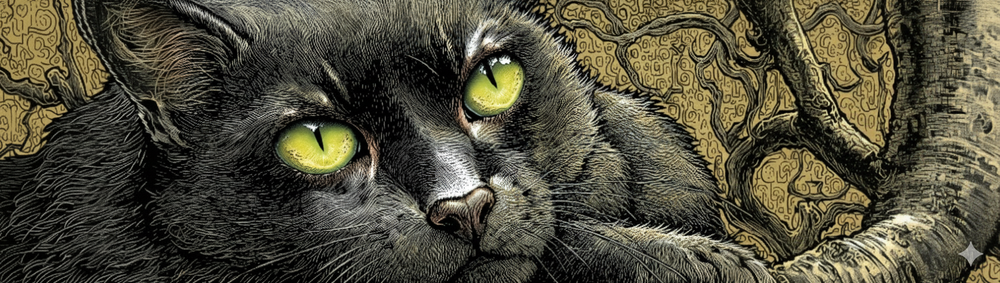

# Spooky Author Identification: Spark NLP Pipeline


The Kaggle Spooky Author Identification competition challenges participants with predicting the famous author (Edgar Allan Poe, HP Lovecraft, and Mary Shelley) based on short excerpts from horror stories. <br> 

**Competition Website:** https://www.kaggle.com/competitions/spooky-author-identification <br>

Kaggle provide two files:
- a labelled train.csv (id, text, author)
- an unlabelled test.csv (id, text)

## How to Run Locally
**Setup**
### 1. Create new project folder
```bash
mkdir spooky-author-project
cd spooky-author-project
```
### 2. Download main notebook
- For Windows
```bash
Invoke-WebRequest -Uri "https://raw.githubusercontent.com/lauraFortune/kaggle-spooky-author/main/notebooks/spooky-author-identification.ipynb" -OutFile "spooky-author-identification.ipynb"
```
- For Mac/Linux:
```bash
curl -O https://raw.githubusercontent.com/lauraFortune/kaggle-spooky-author/main/notebooks/spooky-author-identification.ipynb
```
### 3. Install dependencies
```bash
pip install pyspark==3.5.3 matplotlib wordcloud pandas jupyter
```

### 4. Setup Data
```bash
mkdir data
```
- Download train.csv and test.csv and place in data folder: <br>
https://www.kaggle.com/competitions/spooky-author-identification/data 

### 5. Run notebook
- jupyter notebook spooky-author-identification.ipynb <br>

**Key Project Files:**
- `notebooks/spooky-author-identification.ipynb` - Local PySpark notebook
- `notebooks/spooky-author-identification-databricks.ipynb` - Original Databricks version
- `data/` - Kaggle training and test datasets
- `output` - Kaggle submission (predictions CSV)

